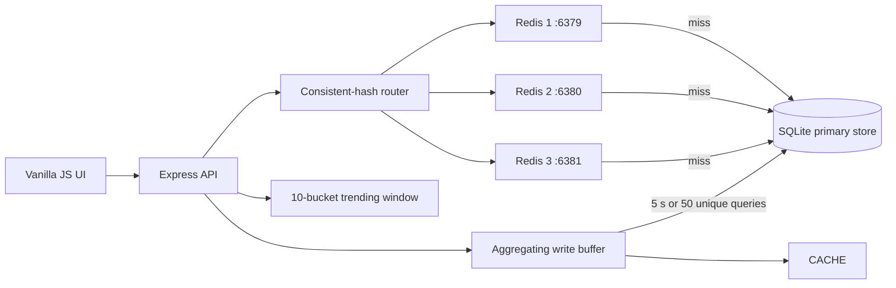

# Search Typeahead System

A complete search typeahead assignment demonstrating low-latency prefix lookup, distributed Redis caching with client-side consistent hashing, recency-aware trending, asynchronous batch writes, and a clean responsive interface.


## Quick start

Requirements: Node.js 20 or newer.

### Zero-dependency cache mode

```bash
npm install
npm run setup
npm start
```

`npm run setup` downloads the open-source dataset, converts it to `query,count`, and loads SQLite. Open [http://localhost:3000](http://localhost:3000) after starting the server.

This default mode uses four logical in-process cache nodes and remains useful for tests and machines without Docker.

### Distributed Redis mode

Requirements: Docker Desktop or Docker Engine with Compose.

```bash
docker compose up --build
```

This starts:

- Redis 1 on host port `6379`
- Redis 2 on host port `6380`
- Redis 3 on host port `6381`
- The application on [http://localhost:3000](http://localhost:3000)

The three Redis servers are independent processes with separate persistent volumes. The application—not Redis Cluster—uses the custom consistent-hashing ring to choose the node for each prefix.

To run only Redis in Docker and the application locally:

```bash
npm run redis:up
CACHE_BACKEND=redis npm start
```

Stop the containers with:

```bash
npm run redis:down
```

Useful commands:

```bash
npm test
npm run benchmark
npm run download-data
```

Downloaded/generated artifacts (`dataset/queries.csv`, `dataset/metadata.json`, and `data/typeahead.db`) are ignored by Git because they can be reproduced from the documented source.

## Dataset

The project uses the **Wikimedia Pageviews** open dataset, not synthetic data.

- Source file: [Wikimedia hourly Pageviews for January 1, 2025 at 00:00 UTC](https://dumps.wikimedia.org/other/pageviews/2025/2025-01/pageviews-20250101-000000.gz)
- Documentation: [Wikimedia Analytics Pageviews](https://dumps.wikimedia.org/other/pageviews/readme.html)
- License: [Creative Commons CC0 1.0](https://creativecommons.org/publicdomain/zero/1.0/)
- Original fields: `domain_code page_title count_views total_response_size`
- Transformation: retain `en.wikipedia.org` page titles, decode titles, map `page_title → query`, map `count_views → count`, exclude administrative namespaces, and retain the 120,000 highest-count unique titles.
- Final input: `dataset/queries.csv` with exactly the assignment format `query,count`.

The original compressed source is roughly 46 MB. `npm run download-data` caches it under `data/`, so subsequent setup runs do not download it again.

## Architecture



The Redis deployment routes every cache key through a custom MD5 consistent-hashing ring with 150 virtual nodes per Redis server. The selected server is checked before falling back to SQLite. Search submissions are acknowledged immediately, recorded in the recent-activity window, and aggregated before one transactional database flush.

## API

| Method | Endpoint | Behavior |
|---|---|---|
| `GET` | `/suggest?q=iph&mode=count` | Up to 10 prefix matches ranked by historical count |
| `GET` | `/suggest?q=iph&mode=trend` | Up to 10 matches ranked with historical and recent activity |
| `POST` | `/search` | Accepts `{ "query": "iphone" }`, returns `202` and queues the update |
| `GET` | `/trending` | Current top 10 searches |
| `GET` | `/cache/debug?prefix=iph&mode=count` | Cache owner, ring position, hit state, distribution, node stats |
| `GET` | `/stats` | Latency, cache, database, batch, and dataset metrics |
| `POST` | `/flush` | Development-only manual batch flush |
| `POST` | `/cache/nodes/:id` | Development-only node simulation with `{ "action": "add" }` or `remove` |

Example:

```bash
curl "http://localhost:3000/suggest?q=iph&mode=count"
curl -X POST http://localhost:3000/search \
  -H "content-type: application/json" \
  -d '{"query":"iphone charger"}'
curl -X POST http://localhost:3000/flush
```

## Core decisions

- **Primary store lookup:** SQLite uses its primary-key index to restrict candidates to the normalized prefix range, then returns the highest-count 10.
- **Consistent hashing:** Three Redis nodes own keys through a 450-point MD5 ring. Adding a fourth node remaps only the affected ring ranges rather than nearly every key.
- **Mode-safe cache:** Keys include ranking mode (`suggest:count:iph`), preventing historical and trending rankings from contaminating each other.
- **Trending:** Ten 30-second buckets form a five-minute window. Recent counts decay by `0.9^age`. Both historical and recent values are normalized before applying the 40/60 weighting.
- **Batching:** Repeated searches are aggregated by normalized query. A flush occurs after 50 unique queries or five seconds. One SQLite transaction updates all unique rows.
- **Consistency:** Reads are eventually consistent by up to the flush interval. Abrupt process failure can lose buffered events; production would place a durable log or queue before the aggregator.
- **Deployment modes:** `CACHE_BACKEND=redis` uses three external Redis processes; `CACHE_BACKEND=memory` preserves a simple local/test fallback.

For the detailed walkthrough and viva notes, see [docs/architecture.md](docs/architecture.md). Benchmark instructions and interpretation are in [docs/performance-report.md](docs/performance-report.md). A direct requirement mapping is provided in [docs/assignment-compliance.md](docs/assignment-compliance.md).

## Project report

- [Submission-ready PDF report](docs/Search-Typeahead-Project-Report.pdf)
